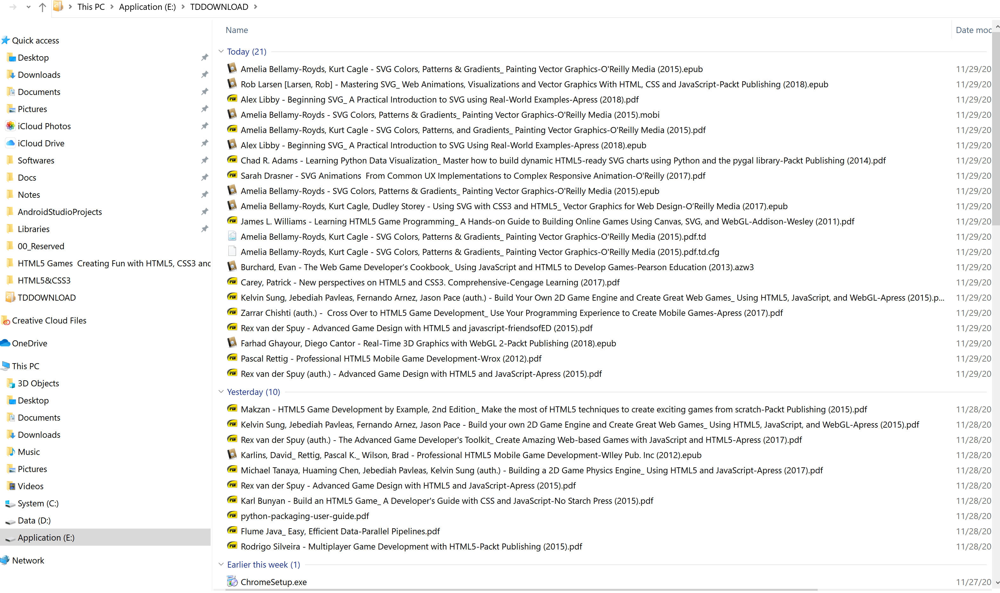

# 快速学习的途径及方法 -思考、探讨
## Why WYSIWYG tools aren’t used in this book - 即：刚开始学习的时候，**写代码**是用开发工具,诸如Visual Studio或InteliJ Idea，还是直接用文本工具，如Vim？
   * 参考书：(Essential Guides) Craig Grannell, Victor Sumner, Dionysios Synodinos - The Essential Guide to HTML5 and CSS3 Web Design-friendsofED (2012).epub 的理念。
## 是否需要：Flying before Walking - 即：
      1. 你开始学习知识（看一本书）之前，是否要先最快速的把书翻一遍，看看该书是否值得学习，如果不是，是否，部分值得作为掌握该知识的学习书籍，如果是，是哪部分值得。。。 
         - 爸爸觉得学习知识，都不能只看一本书，要几本书，互相印证着学比较好，作为 计算机专业，这一点，爸爸认为很重要。-- 一定要取不同书籍之长。。。
         - 这篇文档，就是通过浏览大量的书籍和网站，做的规划，组织，形成的学习脉络。。，然后，就大致知道哪部分知识，通过哪本书进行 深入 的学习，
      2. 如何找到最适合的书籍，WebSite - 这一点，爸爸跟你演示，说明。。。要记得问爸爸。。感觉这一点也很重要。。
   * 参考书：Pascal Rettig - Professional HTML5 Mobile Game Development-Wrox (2012).pdf - 这书不错，后续考虑作为参考书之一
      + Chapter1 Flying Before You Walk
## 学习Web Programming，是不是，要先知其然，然后再去知其所以然。也就是说：
      + 学习的时候是不是先，Copy代码，粘贴代码，然后，运行代码，看看代码运行的结果，知道了结果，然后再去深入探究为什么是这个结果，也就是深入学习。编程 应该先 实践，然后，再上升到理论学习。
## 作为软件工程的学生，在学习网站开发的时候，是否也要同时关注，如何对开发的Web项目，进行简单的项目管理？比如，如何架构，如何协作，如果管理进度等等。
   * 参考书：Jonathan Lane, Tom Barker, Joe Lewis, Meitar Moscovitz - Foundation Website Creation with HTML5, CSS3, and JavaScript-friendsofED (2012).epub
     - Chapter 3 Planning and High-Level Design
## 知识检索的途径与方法
   * 检索工具 - 养成用一下工具的习惯，包括检索 **教程**， **教材**， **知识点**，**例子**。
      1. Google - **提高搜索的效率，需要学习使用 参数，如：site，filetype等。**
      2. Youtube - **搜索视频教程**
      3. GitHub - **搜索资料，以及代码例子**
      4. 书籍
         + `http://gen.lib.rus.ec/` 
   * 例子 - 关于 Web开发 的 教材搜集 过程
      1. 书籍搜索及下载
      2. 目前已下载的书目清单
         + 这是爸爸已经重新整理的D:\Libraries\00_ComputerScience\WebProgramming目录，爸爸已全部Flying过的书目：）
         <br>
         <div align="left">
             
         </div><br>
         + 已下载，尚未整理，也尚未浏览的书目 - 主要是 HTML5与游戏 以及 HTML5与SVG 两个方面的书
<br>
<!--
         <div align="left">
            
         </div><br>
-->
         这么多书，不可能一本一本的看过去，因此，Flying的方法就很重要了。
      3. 这些书目及相关的网站是怎么得来得？
         + 这个网站：`http://gen.lib.rus.ec/` 中书籍的搜索方法
            - 
# 书目清单及参考（网站，视频，教材，教程等）
   * 权威参考网站
      + [W3C - STANDARDS](https://www.w3.org/standards/)<br>
         >The World Wide Web Consortium (W3C) is an international community where Member organizations, a full-time staff, and the public work together to develop Web standards. Led by Web inventor and Director Tim Berners-Lee and CEO Jeffrey Jaffe, W3C's mission is to lead the Web to its full potential. Contact W3C for more information.
      + [HTML - Living Standard — Last Updated 26 November 2019](https://html.spec.whatwg.org/) - 最权威的官网，关于HTML的规范<br>
      + [HTML & CSS](https://www.w3.org/standards/webdesign/htmlcss) - 这个是W3C 关于HTML和CSS相关技术的权威解释<br>
         >HTML (the Hypertext Markup Language) and CSS (Cascading Style Sheets) are two of the core technologies for building Web pages. HTML provides the structure of the page, CSS the (visual and aural) layout, for a variety of devices. Along with graphics and scripting, HTML and CSS are the basis of building Web pages and Web Applications. Learn more below about:
   * 书目清单（优先级顺序）-按类别分
      + Comprehensive（综合） - HTML5/CSS3 and Javascript
         - :eight_pointed_black_star: :+1:Niederst Robbins, Jennifer - Learning Web Design _ A Beginner’s Guide to HTML, CSS, JavaScript, and Web Graphics-O’Reilly Media (2018).pdf
         - :eight_pointed_black_star: :+1:Jacob Seidelin - `HTML5 Games, 2nd Edition_ Creating Fun with HTML5, CSS3 and WebGL-Wiley (2014)`.pdf
      + Basic HTML5 and CSS3
         - :+1::thumbsup:Patrick M. Carey - New Perspectives HTML5 and CSS3_ Comprehensive-Cengage Learning (2017).pdf - **知识点学习主要书籍**
         - :thumbsup:Sasha Vodnik - HTML5 and CSS3, Illustrated Complete-Course Technology (2015).pdf - **这本为辅，因为旧，但知识点脉络清晰**
         - (Essential Guides) Craig Grannell, Victor Sumner, Dionysios Synodinos - `The Essential Guide to HTML5 and CSS3 Web Design-friendsofED (2012)`.epub
      + Network And WebSocket
         - Vanessa Wang, Frank Salim, Peter Moskovits - `The Definitive Guide to HTML5 WebSocket-Apress (2013)`.pdf
      + Graphics
         - Canvas
         
         - SVG - Scalable Vector Graphics
            + Peter Lubbers, Brian Albers, Frank Salim - `Pro HTML5 Programming (Professional Apress)-Apress (2011)`.epub
            >C H A P T E R  3 - Scalable Vector Graphics
      + Geolocation - 地理位置
      + Muti Media - 多媒体：声音与视频
         - []() - 的<br>
      + Web Storage
      + WebGL -
      + 工具书 - 即要查某个知识的用法，可以查查下面的书
         - (Complete Reference Series) Thomas Powell - HTML & CSS_ The Complete Reference, Fifth Edition (Complete Reference Series)-McGraw-Hill Osborne Media (2010).pdf
         - Keith J. Grant - CSS in Depth-Manning Publications (2018).pdf
   * 其他参考
      - [Notes]() -- 这<br>

# html知识总览

   * :eight_pointed_black_star:关于 Encoding - 文件的编码格式，-- **需要学习的知识** --
      + Google Search
         1. how to convert file encoding with command line tool in windows site:stackoverflow.com
      + 参考 - 书中关于编码的看看
         - Book: Web Standards Mastering HTML5, CSS3, and XML(2014)  -参考：**CHAPTER 2 - Internationalization**
         - [How to Encode an Excel File to UTF-8 or UTF-16](https://help.surveygizmo.com/help/encode-an-excel-file-to-utf-8-or-utf-16)<br>
      + 转换与查询的方法
         - Linux
            + 参考
               1. [How to Convert Files to UTF-8 Encoding in Linux](https://www.tecmint.com/convert-files-to-utf-8-encoding-in-linux/)<br>
               2. [HowTo: Check and Change File Encoding In Linux](https://www.shellhacks.com/linux-check-change-file-encoding/)<br>
               3. [How to find encoding of a file via script on Linux?](https://stackoverflow.com/questions/805418/how-to-find-encoding-of-a-file-via-script-on-linux)<br>
            + 步骤与方法
               1， 查询文档的编码格式
               ```bash
                   $ file -i Car.java
               ```
               2. 转换（更改）编码格式
               ```bash
                   $ iconv option
                   $ iconv options -f from-encoding -t to-encoding inputfile(s) -o outputfile 
               ```
               >Where `-f` or `--from-code` means input encoding and `-t` or `--to-encoding` specifies output encoding.
                To list all known coded character sets, run the command below:
               3. 列可用编码清单
               ```bash
                   $ iconv -l
               ```
         - Windows
            + 参考
               1. [Get encoding of a file in Windows](https://stackoverflow.com/questions/3710374/get-encoding-of-a-file-in-windows)<br>
               2. [Control encoding of batch-created file](https://superuser.com/questions/1408312/control-encoding-of-batch-created-file/1408345) - 这个是批量更改文件属性的方法，关键是学习其中的方法<br>
               3. [Converting UTF-16 to UTF-8 using WideCharToMultiByte in C on Windows](https://stackoverflow.com/questions/57134511/converting-utf-16-to-utf-8-using-widechartomultibyte-in-c-on-windows) - 这个是用C语言的方法，也是学习其中的C语言的代码方法<br>
               4. [Convert from ANSI to UTF-8](https://stackoverflow.com/questions/31471087/convert-from-ansi-to-utf-8) - 这个是Python的方法<br>
               5. [Convert sources to UTF-8 without BOM](https://stackoverflow.com/questions/54534765/convert-sources-to-utf-8-without-bom) - 这个是用 Window PowerShell的 脚本方法，PowerShell是微软新开发的Window 10操作系统上用到的脚本 <br>
               5. [Keep Same Encoding With Set-Content Multiple Files in PowerShell](https://stackoverflow.com/questions/56133188/keep-same-encoding-with-set-content-multiple-files-in-powershell)<br>
               6. PowerShell的官方教程 及 与Encoding相关的内容
                  - [Understanding file encoding in VSCode and PowerShell](https://docs.microsoft.com/en-us/powershell/scripting/components/vscode/understanding-file-encoding?view=powershell-6)<br>
                  - [Set-Content](https://docs.microsoft.com/en-us/powershell/module/microsoft.powershell.management/set-content?view=powershell-6)<br>
               7. [Changing PowerShell's default output encoding to UTF-8](https://stackoverflow.com/questions/40098771/changing-powershells-default-output-encoding-to-utf-8)<br>
               8. [HOW TO SOLVE UNICODE ENCODING ISSUES - WHAT IS ENCODING?](https://blog.invivoo.com/how-to-solve-unicode-encoding-issues/)<br>
               10. [WMIC command in batch outputting non UTF-8 text files](https://stackoverflow.com/questions/55310573/wmic-command-in-batch-outputting-non-utf-8-text-files)<br>
         - Mac OS
            + 参考
               1. [How to Determine File Encoding in Mac OS by Command Line](http://osxdaily.com/2017/09/02/determine-file-encoding-mac-command-line/)<br>
               2. []()<br>
   * :eight_pointed_black_star:Why Bitwise - Bitwise Operators 的相关知识，是否需要用到，值得探索，要找权威的书籍看，-- **需要学习的知识：如果只是想当码农，就不用多了解，否则，必须深入研究！** --
      + Google Search
         1. why use bitwise operators
            - [ECMAScript Language Specification - 5.1版](http://www.ecma-international.org/ecma-262/5.1/ECMA-262.pdf)<br>
            - [ECMAScript Language Specification - 2019年最新版10.0版](https://www.ecma-international.org/ecma-262/10.0/index.html)<br>
            - [ECMAScript® 2020 Language Specification](https://tc39.es/ecma262/) - 2020版？<br>
            - [Bitwise operators - From MDN web docs](https://developer.mozilla.org/en-US/docs/Web/JavaScript/Reference/Operators/Bitwise_Operators) - 注意 这个网址中/en-US/表示：语言是**美国英语**<br>
            - [按位操作符 - From MDN web docs 中文版](https://developer.mozilla.org/zh-CN/docs/Web/JavaScript/Reference/Operators/Bitwise_Operators) - 注意 这个网址中/zh-CN/表示：语言是**中文**<br>
            - [Bitwise operation](https://en.wikipedia.org/wiki/Bitwise_operation) - From Wikipedia, the free encyclopedia<br>
            - [The Bitwise Operators](https://users.cs.cf.ac.uk/Dave.Marshall/PERL/node36.html)<br>
            - [Bitwise Operators in C/C++](https://www.geeksforgeeks.org/bitwise-operators-in-c-cpp/)<br>
            - [Bitwise operators — Facts and Hacks](https://medium.com/@shashankmohabia/bitwise-operators-facts-and-hacks-903ca516f28c) - 参考其中的例子，思考：这些例子能解决什么问题<br>
            - [Exclusive or](https://en.wikipedia.org/wiki/Exclusive_or) - From Wikipedia, the free encyclopedia<br>
            - [一件Intent教我的事： Bitwise Operation](https://medium.com/@kazafchen/%E4%B8%80%E4%BB%B6intent%E6%95%99%E6%88%91%E7%9A%84%E4%BA%8B-bitwise-operation-dd3a388ae34e) - 比较浅显的说明，为何要使用 Bitwise operators<br>
            - [從LeetCode學演算法 - 11 Bitwise Operation (1)](https://medium.com/@desolution/%E5%BE%9Eleetcode%E5%AD%B8%E6%BC%94%E7%AE%97%E6%B3%95-11-bitwise-operation-1-3117c4ce925d) - 练习题，可以很好理解 Bitwise Operators<br>
            - [Using JavaScript’s Bitwise Operators in Real Life](https://codeburst.io/using-javascript-bitwise-operators-in-real-life-f551a731ff5?gi=8a76f261d8d2) - 通过例子，了解 Bitwise operation 的**用法**<br>
            - [为什么不要在 JavaScript 中使用位操作符？](https://jerryzou.com/posts/do-you-really-want-use-bit-operators-in-JavaScript/) - 因为这是2015年得文章，随着技术得发展，对于现在（2019年）已经不一定正确，但其中关于**数据本质**部分可以看看，更深入的了解，请找权威的书籍或资料 - [ECMAScript Language Specification - 这是后一个文档的镜像](https://www.ecma-international.org/ecma-262/5.1/#sec-11.10) 或者[ECMAScript Language Specification](http://www.ecma-international.org/ecma-262/5.1/ECMA-262.pdf)。也关注一下文章后面的“参考资料”部分<br>
      + 参考书

   * Setting Up Your Development Environment - 关于开发环境的设置
      + 参考
         - Books
            + (Learn Apress) Gavin Williams - Learn HTML5 and JavaScript for Android-Apress (2012).epub - 只是一个引导，因该书已过时，不用用该书的方法了，至少不用全用。。。
              >Setting Up Your Development Environment 章节
         - WebSite
   * Testing and Debugging - 关于测试和调试
      + 参考
         - Books
            + (Training & Reference) Anne Boehm, Zak Ruvalcaba - Murach's HTML5 and CSS3-Mike Murach & Associates (2015).pdf
               >Chapter2 How to test, debug, and validate HTML and CSS file
         - WebSite
            + You can easily test your HTML/CSS ideas with [JsFiddle](http://jsfiddle.net)<br>
               >You can easily test your HTML/CSS ideas with JsFiddle (`http://jsfiddle.net`), which includes an online editor for snippets build from HTML, CSS, and JavaScript. 
# Sample
   * Google Search
      + html5 css3 sample site:github.com
      + JavaScript example site.github.com
   * GitHub Search
      + html5 css3 JavaScript
         - [html5-css3-javascript](https://github.com/topics/html5-css3-javascript) -  Code sample concern with html5 css3 JavaScript <br>
         - [edysegura/code-samples](https://github.com/edysegura/code-samples)<br>
